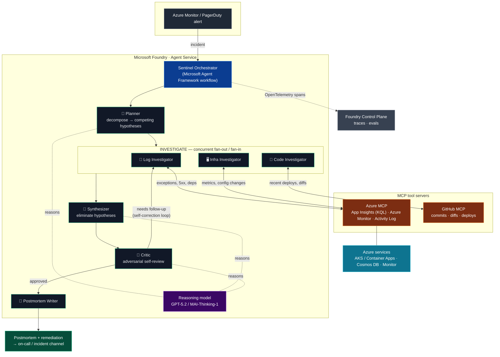

# Sentinel — Architecture

Sentinel is a multi-agent **reasoning** system that performs incident root-cause
analysis. It is composed as a Microsoft Agent Framework workflow, runs on a
Microsoft Foundry reasoning deployment, and gathers live evidence through MCP
tool servers (Azure MCP + GitHub MCP). Every step is emitted to OpenTelemetry so
the reasoning is observable in the Foundry Control Plane.

## Reasoning flow

## How the required stack is used

| Requirement | Where it shows up |
|-------------|-------------------|
| **Microsoft Foundry** | Hosts the reasoning model deployment; OpenTelemetry traces + evals land in the Foundry Control Plane (`tracing.py`, `.env`). |
| **Microsoft Agent Framework** | Six role agents composed with `WorkflowBuilder` fan-out/fan-in + a `MagenticBuilder` synthesize⇄critique loop (`maf_workflow.py`). |
| **Azure MCP** | Log Investigator + Infra Investigator query App Insights (KQL), Azure Monitor metrics, and the activity log through the Azure MCP server (`tools.py`, `mcp_client.py`). |
| **GitHub MCP** | Code Investigator correlates the incident with recent deploys/diffs via the hosted GitHub MCP server. |
| **Azure services** | The agent reasons over real Azure resources — AKS / Container Apps, Cosmos DB, Azure Monitor. |
| **GitHub Copilot** | Used to build the project (Foundry Toolkit for VS Code authoring path). |

## Why this is a *reasoning* agent, not a chatbot

1. **Hypothesis generation** — the Planner enumerates competing causes instead of pattern-matching one answer.
2. **Evidence-tagged investigation** — each finding explicitly *supports* or *refutes* specific hypotheses.
3. **Deductive elimination** — the Synthesizer removes refuted hypotheses and elevates the survivor.
4. **Adversarial self-correction** — the Critic refuses to commit until temporal causality is independently verified, sending the team back for a targeted follow-up (the loop edge above).
5. **Confidence-gated output** — a conclusion below 0.80 confidence is flagged for a human instead of asserted.

The same engine reaches *different* correct conclusions on different incidents
(`checkout_500` → bad deploy; `api_latency_infra` → resource exhaustion), which
is the proof it reasons over evidence rather than replaying a script.
